# SCA Smartcard Pipeline — Technical Collaboration Report

> **Report Date:** 2026-02-25  
> **Repo:** `SCA-Smartcard-Pipeline-3`  
> **Status:** 3DES key recovery is producing **incorrect keys**. RSA is functional.  
> **Purpose:** Handoff document for collaborative debugging.

---

## 1. Client Requirements

The client has a set of EMV smartcards (Mastercard + Visa) and wants a **Side-Channel Analysis (SCA) ML pipeline** that:

| Requirement | Details |
|---|---|
| Extract 3DES keys | KENC, KMAC, KDEK (each 16 bytes / 128-bit 2-key TDES) |
| Extract RSA keys | CRT private key components: P, Q, DP, DQ, QINV |
| Recover PIN | From VERIFY (00 20) APDU commands |
| Input | Raw power traces in `.npz` format + metadata `.csv` |
| Output | Excel/CSV with one row per card, containing extracted keys |
| Dataset | Mastercard: 3DES traces. Visa: RSA traces (Internal Authenticate) |

### Key Output Columns Expected
```
Card_ID, Card_Type, Track2, ATC,
3DES_KENC, 3DES_KMAC, 3DES_KDEK,
RSA_CRT_P, RSA_CRT_Q, RSA_CRT_DP, RSA_CRT_DQ, RSA_CRT_QINV,
PIN
```

---

## 2. Repository Structure

```
SCA-Smartcard-Pipeline-3/
├── main.py                   # Pipeline orchestrator
├── data_loader.py            # 3DES-specific NPZ loader
├── label_generator.py        # Legacy label generator (has poison bug)
├── src/
│   ├── ingest.py             # TraceDataset: file scanning + filtering
│   ├── gen_labels.py         # Label computation (S-Box outputs)
│   ├── feature_eng.py        # POI selection + feature extraction
│   ├── preprocess.py         # Trace alignment (FFT cross-correlation)
│   ├── train_ensemble.py     # ZaidNet ensemble training
│   ├── inference_3des.py     # 2-stage 3DES key attack
│   ├── inference_rsa.py      # RSA CRT ensemble attack
│   ├── model_zaid.py         # ZaidNet CNN architecture
│   ├── model_rsa.py          # RSA model architecture
│   ├── crypto.py             # DES tables, round key math, EMV derivation
│   ├── pyDes.py              # Pure-Python DES engine
│   └── verify_masterkey.py   # Standalone key verification script
├── Input1/
│   ├── Mastercard/           # 3DES NPZ traces + CSV metadata
│   └── Visa/                 # RSA NPZ traces (NO 3DES keys)
└── SCA-Smartcard-ML-Pipeline/ # LEGACY nested repo — DO NOT USE
    └── src/gen_labels.py     # Has hardcoded Visa fallback (poison source)
```

---

## 3. Cryptographic Background

### 3.1 — 3DES (2-Key TDES, EMV)

```
KENC = K1 || K2   (16 bytes total)
Encrypt(plaintext) = DES_enc(K1, DES_dec(K2, DES_enc(K1, plaintext)))
```

The **challenge** (plaintext input used in the Generate AC or Internal Authenticate command) is:
```
ATC_0 .. ATC_7   (8-byte Application Transaction Counter block)
```

**DES Round Key Generation (the key schedule):**
- `K1 (8 bytes)` → PC1 → `C0D0 (56 bits)` → left-shift by round[i] → `CiDi` → PC2 → `RKi (48 bits)`
- RK1 is produced with a **1-bit left rotation** of C0D0
- RK16 is produced with **zero rotation** (C16D16 == C0D0) → important for Stage 2 reconstruction

**S-Box Attack Target:**
In Round 1, the operation is:
```
E(R0) XOR K1_RK1 → 8 groups of 6 bits → each group enters one S-Box → 4-bit output
```

The model learns: **power consumption ≈ f(S-Box output)**

### 3.2 — RSA CRT (Internal Authenticate)

The card computes:
```
Signature = CRT_RSA(message, P, Q, DP, DQ, QINV)
```

The attack leaks **byte-by-byte** of P, Q, DP, DQ, QINV (each 512-bit / 64 bytes = 128 hex chars).

---

## 4. Full Pipeline Flow

### 4.1 — Training Flow (both 3DES and RSA)

```mermaid
flowchart TD
    A["Input: NPZ trace files\n+ CSV metadata"] --> B["src/ingest.py\nTraceDataset\nFilter by card_type + trace_type"]
    B --> C["src/feature_eng.py\nPass 1: POI Discovery\n(Correlation + Variance-based)"]
    C --> D["src/preprocess.py\nFFT Cross-Correlation\nTrace Alignment"]
    D --> E["src/gen_labels.py\ncompute_labels\nGenerate S-Box output labels\nY_labels_kenc_s1_sbox1..8.npy"]
    D --> F["Save X_features_s1.npy\nX_features_s2.npy\nY_meta.csv"]
    E --> F
    F --> G["src/train_ensemble.py\ntrain_ensemble\nTrain ZaidNet models\n5 models × 8 S-Boxes × 2 stages × 3 key types\n= 240 models total"]
    G --> H["Saved models:\nModels/3des/kenc/s1/sbox1_model0..4.pth\n..."]
```



### 4.2 — Inference / Attack Flow (3DES)

```mermaid
flowchart TD
    A["Test trace NPZ"] --> B["src/feature_eng.py\nPass 2 only\n(reuse saved reference_trace.npy)"]
    B --> C["X_features_s1.npy\nX_features_s2.npy"]
    C --> D["src/inference_3des.py\nrecover_3des_keys"]
    D --> E["Stage 1: Recover K1\nFor each of 8 S-Boxes:\n  Load ensemble models\n  Avg softmax probs\n  Score each of 64 key guesses\n  Winners = 8 × 6-bit chunks = 48 bits = RK1"]
    E --> F["reconstruct_key_from_rk1\nInverse PC2 → Inverse shift-1 → Inverse PC1\n→ K1 (64 bits with parity)"]
    F --> G["compute_batch_des\nC1 = DES_enc(K1, challenge)\nfor each trace"]
    G --> H["Stage 2: Recover K2\nFor each of 8 S-Boxes:\n  Load stage-2 ensemble models\n  Score key guesses vs. E(R0 of C1)\n  Winners = RK16"]
    H --> I["reconstruct_key_from_rk16\nInverse PC2 → NO shift → Inverse PC1\n→ K2 (64 bits with parity)"]
    I --> J["Output: 3DES_KENC = K1 || K2 (32 hex chars)"]
```



### 4.3 — Inference / Attack Flow (RSA)

```mermaid
flowchart TD
    A["Visa test trace NPZ"] --> B["feature_eng.py: Pass 2"]
    B --> C["X_features.npy"]
    C --> D["For each of 5 components\nP, Q, DP, DQ, QINV"]
    D --> E["src/inference_rsa.py\nperform_rsa_attack\nEnsemble RSA models\n(3 models per component)"]
    E --> F["Per trace: 128 bytes → predicted as 128 × 256-class\nbyte-level classification"]
    F --> G["derive_rsa_crt(P, Q)\nMathematically recompute DP, DQ, QINV\nfrom P and Q for consistency"]
    G --> H["Output RSA_CRT_P, Q, DP, DQ, QINV"]
```



---

## 5. Component Deep Dives

### 5.1 — Data Ingestion (`src/ingest.py`)

**`TraceDataset`** filters `.npz` files by inspecting their array keys:

```python
has_3des = any(k in keys for k in ["T_DES_KENC", "T_DES_KMAC", "T_DES_KDEK"])
has_rsa  = any(k in keys for k in ["ACR_send", "ACR_receive", ...])

if tt == "3des" and has_3des:    keep
elif tt == "rsa" and has_rsa:    keep
```

Each trace row provides:
- Raw waveform: shape `(N_traces, N_samples)`
- Metadata: `T_DES_KENC` (ground truth key, for training labels), `ATC` (challenge), `Track2` (card number prefix)

### 5.2 — Feature Engineering (`src/feature_eng.py`)

**Two-pass approach:**

| Pass | Purpose |
|---|---|
| Pass 1 | POI Discovery — loads ALL training traces, computes correlation between Hamming weight of S-Box outputs and power samples, finds top-K correlated sample indices |
| Pass 2 | Feature Extraction — aligns each trace to reference using FFT cross-correlation, extracts samples at POI indices |

**Default POI config:**
```python
n_s1_pois = 200   # POIs for Stage 1 (K1 attack)
n_s2_pois = 200   # POIs for Stage 2 (K2 attack)
```

> [!WARNING]
> **Known Bug (from `pipeline.log`):** The Correlation POI search **ALWAYS FAILS** and falls back to variance-based POIs:
> ```
> feature_eng - WARNING - Correlation POI union failed. Falling back to Variance-based POIs.
> ```
> This means the POIs are selected based on variance (signal noise) rather than actual information leakage, which **severely degrades model accuracy**.

### 5.3 — Label Generation (`src/gen_labels.py`)

**Computes per-trace S-Box output labels:**

For Stage 1 (targeting K1 at Round 1):
```python
er0 = E(IP(challenge)[32:])       # Expand right half of IP-permuted challenge
sbox_in_i = er0_chunk_i XOR rk1_chunk_i    # 6-bit input per S-Box
sbox_out_i = S_i(sbox_in_i)       # 4-bit output (0..15)
label_i = sbox_out_i              # This is what the model learns to predict
```

For Stage 2 (targeting K2 at Round 1 of decryption = Round 16 of decryption):
```python
c1 = DES_enc(K1, challenge)        # Virtual intermediate ciphertext
er0_s2 = E(IP(c1)[32:])
sbox_in_i = er0_s2_chunk_i XOR rk16_chunk_i
label_i = S_i(sbox_in_i)
```

**Label files saved:**
- `Y_labels_kenc_s1_sbox1.npy` ... `Y_labels_kdek_s2_sbox8.npy`
- `Y_meta.csv` — one row per trace with `ATC_0..7`, `Track2`, `trace_file`

> [!CAUTION]
> **Critical Bug — Visa Data Poisoning:** `label_generator.py` (legacy file, still importable) contains:
> ```python
> # If T_DES_KENC is missing, default to the Green Visa key
> k_hex = "2315208C9110AD402315208C9110AD40"
> ```
> If any Visa traces (which have no T_DES_KENC) leak into the 3DES training set, this code assigns them **a fake hardcoded key**, poisoning the training labels with garbage data.

### 5.4 — Model Architecture (`src/model_zaid.py` — ZaidNet)

Based on Zaid et al. TCHES 2020 — a CNN designed specifically for SCA:

```
Input: (Batch, 1, n_pois)
├── Conv1D(1→16, kernel=11) + BN + ReLU + AvgPool(2)
├── Conv1D(16→32, kernel=11) + BN + ReLU + AvgPool(2)
├── Conv1D(32→64, kernel=11) + BN + ReLU + AvgPool(2)
├── Conv1D(64→128, kernel=11) + BN + ReLU + AvgPool(2)
├── Flatten → Linear(128*(n_pois//16), 1024)
├── Dropout(0.3) + ReLU
├── Linear(1024, 1024) + Dropout(0.3) + ReLU
└── Linear(1024, 16)    ← 16-class (S-Box output 0..15)
```

**Training config (`train_ensemble.py`):**
- Optimizer: Adam, lr=0.001
- Scheduler: ReduceLROnPlateau (factor=0.5, patience=5)
- Epochs: 30 (or until early stopping with patience=8)
- Split: 80/20 (GroupShuffleSplit by `trace_file` if available)
- Models per S-Box: 5 (ensemble of 5)
- Total models for KENC alone: 5 models × 8 S-Boxes × 2 stages = 80 models

### 5.5 — Key Reconstruction (`src/crypto.py`)

**`reconstruct_key_from_rk1(sbox_inputs)`:**

```
8 × 6-bit S-Box chunks → 48-bit RK1
    → Inverse PC2 → 56-bit C1D1 (8 bits unknown/set to 0)
    → Right-rotate by 1 → 56-bit C0D0
    → Inverse PC1 → 64-bit key (parity bits corrected)
```

**`reconstruct_key_from_rk16(sbox_inputs)`:**

```
8 × 6-bit chunks → 48-bit RK16
    → Inverse PC2 → 56-bit C0D0 (NO rotation — C16==C0 for DES)
    → Inverse PC1 → 64-bit key K2
```

**`compute_batch_des(challenges, k1_hex)`:**
Uses `pyDes` to compute `C1 = DES(K1, challenge)` for each trace — this intermediate result becomes the "plaintext" for Stage 2.

---

## 6. RSA Component Details

### RSA Model Architecture (`src/model_rsa.py`)

- Input: feature vector (same shape as 3DES)
- Output: **128 separate classifiers**, each predicting **one byte (0–255)**
- This is a multi-head regression: one forward pass predicts all 128 bytes of P (or Q, DP, DQ, QINV)

### RSA Post-Processing (`src/inference_rsa.py`)

After raw per-component predictions:
```python
derived = derive_rsa_crt(P_hex, Q_hex)
# Always overwrites DP, DQ, QINV with mathematically correct values
# This ensures internal consistency even if P or Q prediction has errors
```

**`derive_rsa_crt` logic (`src/crypto.py`):**
```
N = P × Q
phi = (P-1)(Q-1)
d = e^-1 mod phi      (e tried: 3, then 65537)
DP = d mod (P-1)
DQ = d mod (Q-1)
QINV = Q^-1 mod P
```

---

## 7. Why 3DES Keys Are Wrong — Complete Bug Analysis

> [!IMPORTANT]
> The 3DES key recovery is failing due to **multiple compounding bugs**. Every one of these must be fixed for correct key recovery.

---

### 🔴 Bug #1 — POI Selection Always Falls Back to Variance (CRITICAL)

**Location:** `src/feature_eng.py`

**Evidence from `pipeline.log` (every single run):**
```
feature_eng - WARNING - Correlation POI union failed. Falling back to Variance-based POIs.
```

**What this means:**
- The correlation-based POI search (which uses known keys from `Y_labels` to find trace samples that correlate with predicted S-Box outputs) is failing completely
- The fallback uses **variance** across traces at each sample — this picks noisy or high-variance regions, not necessarily the DES computation time window
- Models trained on variance-based POIs learn **noise features** rather than cryptographic leakage
- Even with perfect labels, if the models are trained on the wrong time window, they will output random predictions

**Root cause candidates:**
- The correlation function may be comparing the wrong arrays (shape mismatch or index mismatch between traces and labels)
- The number of traces available during Pass 1 may be insufficient for meaningful correlation
- The reference key used in Pass 1 may be wrong (all-zeros or misaligned)

**Fix required:** Debug `feature_eng.py` Pass 1 — print intermediate correlation values and check if they are ever non-zero. If the correlation arrays are all ~0, the label arrays and trace arrays are misaligned.

---

### 🔴 Bug #2 — Visa Data Poisoning the Training Labels (CRITICAL)

**Location:** `label_generator.py` (root-level, importable as a module)

**The bug:**
```python
# If T_DES_KENC key is missing (i.e., Visa traces), use hardcoded Green Visa key
k_hex = "2315208C9110AD402315208C9110AD40"
```

**What happens:**
1. Visa NPZ files are loaded (they have no `T_DES_KENC`)
2. The label generator sees an empty/missing key
3. It silently assigns the hardcoded `2315...` key to compute S-Box labels
4. These poisoned labels are mixed with valid Mastercard labels
5. The model learns contradictory signal: same trace pattern → different label depending on which card type it came from
6. Model accuracy collapses

**Evidence:** `src/ingest.py` has code to filter Visa files out, but the filtering happens based on NPZ *array keys*. If a Visa file accidentally contains a `T_DES_KENC` key (even all zeros or corrupted), it passes the filter.

**Fix required:**
- `src/ingest.py`: For `trace_type='3des'`, also check that the file path does NOT contain `visa` or `rsa` as a hard string check (belt-and-suspenders)
- `label_generator.py` / root `src/gen_labels.py`: Raise a `ValueError` if the key is all-zeros or matches the known Visa fallback `2315208C9110AD40...`

---

### 🟠 Bug #3 — Stage 2 Challenge Dependency on K1 Accuracy

**Location:** `src/inference_3des.py` → `recover_3des_keys()`

**The bug logic (lines 247–249):**
```python
c1_ints = compute_batch_des(challenges.tolist(), k1_hex, mode="encrypt")
er0_s2 = _expanded_r0(np.array(c1_ints, dtype=np.uint64))
```

Stage 2 requires computing `C1 = DES_enc(K1, challenge)` for each trace. If K1 (recovered in Stage 1) is **wrong**, then `C1` is wrong, and the expansion `E(R0(IP(C1)))` is completely garbage. Stage 2 then uses the wrong `E(R0)` expansion to score subkey candidates, resulting in a completely wrong K2.

**This creates a cascading failure:**
- Any single wrong S-Box prediction in Stage 1 → K1 is wrong → Stage 2 C1 is wrong → K2 is wrong → Final key is wrong

**Fix required:** Implement a confidence threshold — if Stage 1 subkey scores are too low or ambiguous, abort Stage 2 rather than propagating a wrong K1.

---

### 🟠 Bug #4 — 8 Missing Bits in Inverse PC2 (Structural Limitation)

**Location:** `src/crypto.py` → `reconstruct_key_from_rk1()`

**The math:**
- PC2 takes 56 bits (C1D1) and selects 48 bits for RK1
- 8 bits of C1D1 are **discarded** by PC2
- When inverting PC2, those 8 positions are unknown → set to `0`

```python
c1d1 = [0] * 56
for i in range(48):
    c1d1[_PC2[i]] = rk1_bits[i]
# 8 positions remain 0 (unknown)
```

**Impact:**
- The key reconstruction is working from an **incomplete** 48-bit round key — 8 bits of the original 56-bit key state are assumed to be 0
- This produces a key that may be shifted/wrong by those 8 bits
- `generate_key_candidates_from_rk1()` exists to enumerate all 256 possibilities, but `reconstruct_key_from_rk1()` (used in inference) just picks one (zeros for missing bits)

**Fix required:** The inference should call `generate_key_candidates_from_rk1()` and verify each candidate against a known plaintext-ciphertext pair, selecting the correct one. Currently the pipeline just takes the first guess.

---

### 🟡 Bug #5 — Stage-2 Model Missing for KMAC/KDEK

**Location:** `src/train_ensemble.py` + `src/inference_3des.py`

The inference code has this fallback:
```python
# Backward compat: flat naming in model_dir (stage1 only)
if key_type != "kenc":
    model_paths = []   # KMAC/KDEK get no models → no recovery
```

If the training only produced models in the flat layout (not the `3des/key_type/s1/` structured layout), then KMAC and KDEK are silently skipped and return empty.

**Fix required:** Always train and save models in the structured directory layout.

---

### 🟡 Bug #6 — Normalization Mismatch Between Training and Inference

**Location:** `src/train_ensemble.py` (saves `mean_s1.npy`, `std_s1.npy`) vs `src/inference_3des.py`

The training normalizes using the training set statistics. The inference loads those stats and applies them to test traces. **However**, if the test traces come from a different acquisition setup (different oscilloscope gain, different trigger timing), the distribution shift will make the normalization wrong.

**Evidence:** The log shows that inference runs on 1-trace test sets (Visa NPZ single cards) — the normalization mean/std from 1000 Mastercard training traces may be very different from a single test trace.

---

### 🟡 Bug #7 — `_score_subkey` Vectorization Bug (Potential)

**Location:** `src/inference_3des.py` lines 158–164

```python
sbox_in = er0_chunk ^ k_guess
b1 = (sbox_in >> 5) & 1
b6 = sbox_in & 1
row = (b1 << 1) | b6
col = (sbox_in >> 1) & 0xF
sbox_outputs = np.array([sbox_table[int(r * 16 + c)] for r, c in zip(row, col)], dtype=np.int64)
```

When `er0_chunk` is a numpy array and `k_guess` is a Python int, the XOR result is a numpy array. But `b1`, `b6`, `row`, `col` become numpy arrays — and then the `zip(row, col)` list comprehension iterates element-by-element, which is **very slow** but not incorrect. Should be checked for correctness with edge cases.

---

## 8. Summary of Bugs Ranked by Impact

| Priority | Bug | Impact | Location |
|---|---|---|---|
| 🔴 **1** | Correlation POI always fails → variance-based POIs | Models learn noise | `src/feature_eng.py` |
| 🔴 **2** | Visa data poisons training labels | Wrong labels for unknown-key traces | `label_generator.py`, `src/gen_labels.py` (nested) |
| 🟠 **3** | Stage 2 depends on correct K1 | Cascading failure if K1 wrong | `src/inference_3des.py` |
| 🟠 **4** | 8 missing bits in inverse PC2 | Key reconstruction always slightly wrong | `src/crypto.py` |
| 🟡 **5** | KMAC/KDEK Stage-2 models missing | Only KENC may be recovered | `src/train_ensemble.py` |
| 🟡 **6** | Normalization mismatch | Distribution shift between train/test | `src/train_ensemble.py` |
| 🟡 **7** | `_score_subkey` slow vectorization | Performance issue (not correctness) | `src/inference_3des.py` |

---

## 9. Recommended Fix Sequence


### Step 1: Fix POI Correlation

In `feature_eng.py` Pass 1, add debugging:
```python
print(f"Correlation range: [{corr.min():.4f}, {corr.max():.4f}]")
print(f"Labels shape: {labels.shape}, Traces shape: {traces.shape}")
```
Expected: correlation values should be in range `[0.05, 0.5]` for good leakage.
If all values are `< 0.01`, the label-trace alignment is broken.

### Step 2: Add Strict Visa Guard

In `src/ingest.py`, add to filename heuristic for `trace_type='3des'`:
```python
if "visa" in os.path.dirname(f).lower() or "rsa" in name:
    continue
```

In `src/gen_labels.py`, add at label computation start:
```python
if not k_hex or k_hex.strip('0') == '' or k_hex.upper().startswith('2315208C'):
    raise ValueError(f"Refusing to label with Visa fallback key: {k_hex}")
```

### Step 3: Fix Key Reconstruction

Replace single `reconstruct_key_from_rk1` call in inference with:
```python
candidates = generate_key_candidates_from_rk1(winners_s1)
# Verify each candidate against a known plaintext-ciphertext pair
# (use one of the training traces for which we know the ground truth key)
verified_k1 = [c for c in candidates if verify(c, plaintext, ciphertext)]
k1_int = verified_k1[0] if verified_k1 else candidates[0]
```

---

## 10. Files to Share with Collaborator

| File | Purpose |
|---|---|
| [`main.py`](file:///i:/freelance/SCA-Smartcard-Pipeline-3/main.py) | Pipeline entry point |
| [`src/ingest.py`](file:///i:/freelance/SCA-Smartcard-Pipeline-3/src/ingest.py) | Data loading + Visa filter |
| [`src/feature_eng.py`](file:///i:/freelance/SCA-Smartcard-Pipeline-3/src/feature_eng.py) | POI selection (main bug area) |
| [`src/gen_labels.py`](file:///i:/freelance/SCA-Smartcard-Pipeline-3/src/gen_labels.py) | Label generation |
| [`src/train_ensemble.py`](file:///i:/freelance/SCA-Smartcard-Pipeline-3/src/train_ensemble.py) | Training loop |
| [`src/inference_3des.py`](file:///i:/freelance/SCA-Smartcard-Pipeline-3/src/inference_3des.py) | 2-stage 3DES attack |
| [`src/crypto.py`](file:///i:/freelance/SCA-Smartcard-Pipeline-3/src/crypto.py) | DES math + key reconstruction |
| [`src/model_zaid.py`](file:///i:/freelance/SCA-Smartcard-Pipeline-3/src/model_zaid.py) | ZaidNet CNN |
| [`label_generator.py`](file:///i:/freelance/SCA-Smartcard-Pipeline-3/label_generator.py) | Legacy file with Visa poison bug |
| [`pipeline.log`](file:///i:/freelance/SCA-Smartcard-Pipeline-3/pipeline.log) | Full run logs showing POI failures |

---

## 11. Academic References

| Reference | Used For |
|---|---|
| Zaid et al., "Methodology for efficient CNN architectures in profiling attacks", TCHES 2020 | ZaidNet model architecture |
| NIST FIPS 46-3 | DES S-Box tables, PC1, PC2, IP permutations |
| EMV Book 2 (Application Independent ICC to Terminal Interface Requirements) | EMV session key derivation (KENC/KMAC/KDEK from master key + ATC) |
| Kocher et al., "Differential Power Analysis", CRYPTO 1999 | Theoretical basis for S-Box correlation attack |
| ISO/IEC 7816-4 | APDU command parsing (Generate AC 80 AE, Internal Authenticate 00 88) |
| rsatool (GitHub: ius/rsatool) | RSA CRT parameter derivation from P and Q |
